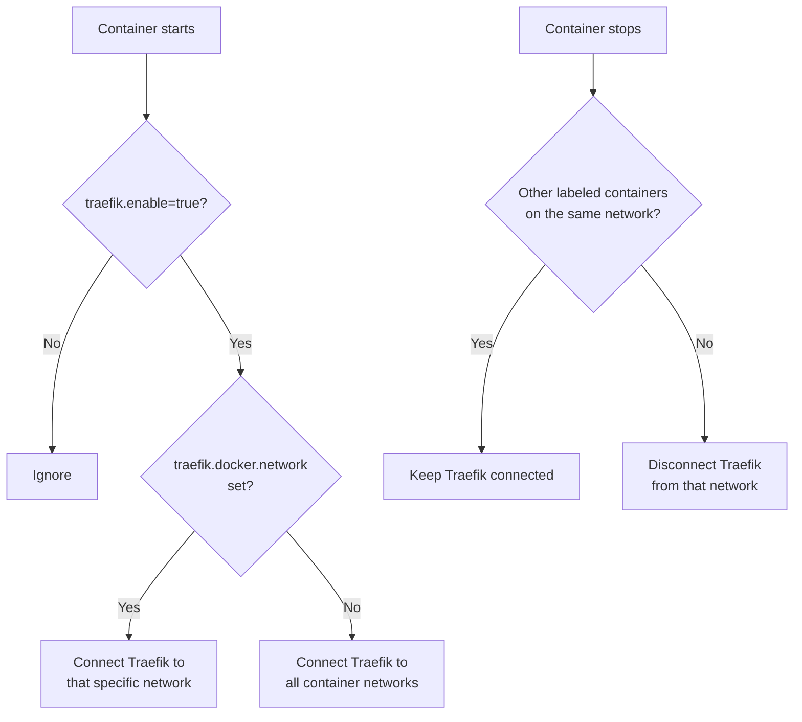

# Traefik Network Connector


[](https://deepwiki.com/obeone/traefik_network_connector)

Automatically connects Traefik to the right Docker networks —
no shared network, no manual intervention.

---

## 🤔 Why this exists

With Traefik and multiple Docker Compose stacks, Traefik must be on the
same network as each proxied container. The usual fix is a single shared
network for everything — but that kills isolation between stacks.

**This daemon solves that.** It listens to Docker events and
automatically connects (and disconnects) Traefik to the right networks
as containers start and stop.

---

## 🚀 Quick start

Create a `docker-compose.yaml` for your Traefik stack:

```yaml
services:
  traefik:
    image: traefik:v3
    container_name: traefik
    command:
      - "--providers.docker=true"
      - "--providers.docker.exposedbydefault=false"
      - "--entrypoints.web.address=:80"
      - "--entrypoints.websecure.address=:443"
      - "--certificatesresolvers.letsencrypt.acme.tlschallenge=true"
      - "--certificatesresolvers.letsencrypt.acme.email=you@example.com"
      - "--certificatesresolvers.letsencrypt.acme.storage=/letsencrypt/acme.json"
    ports:
      - "80:80"
      - "443:443"
    volumes:
      - /var/run/docker.sock:/var/run/docker.sock
      - ./letsencrypt:/letsencrypt

  traefik-network-connector:
    image: obeoneorg/traefik_network_connector:latest
    volumes:
      - /var/run/docker.sock:/var/run/docker.sock
    environment:
      TRAEFIK_CONTAINERNAME: traefik   # must match container_name above
    restart: unless-stopped
```

```bash
docker compose up -d
```

Done. ✅ The connector is now watching Docker events.

---

## 📦 Using it in your app stacks

In **any other Compose stack**, just add `traefik.enable=true`:

```yaml
# ~/myapp/docker-compose.yaml
services:
  web:
    image: myapp:latest
    labels:
      - "traefik.enable=true"
      - "traefik.http.routers.myapp.rule=Host(`myapp.${DOMAIN}`)"
      - "traefik.http.routers.myapp.entrypoints=websecure"
      - "traefik.http.routers.myapp.tls.certresolver=letsencrypt"
      - "traefik.http.services.myapp.loadbalancer.server.port=8080"
```

```bash
# in ~/myapp/
docker compose up -d
# → Traefik is automatically connected to myapp's network 🎉
# → When you stop it, Traefik disconnects automatically
```

### 🎯 Targeting a specific network

If a container has multiple networks, you can restrict which one Traefik
connects to:

```yaml
labels:
  - "traefik.enable=true"
  - "traefik.docker.network=myapp_frontend"
  - "traefik.http.routers.myapp.rule=Host(`myapp.${DOMAIN}`)"
  - "traefik.http.routers.myapp.entrypoints=websecure"
  - "traefik.http.routers.myapp.tls.certresolver=letsencrypt"
  - "traefik.http.services.myapp.loadbalancer.server.port=8080"
```

> ⚠️ Docker Compose prefixes network names with the project name.
> A network named `frontend` in a project folder `myapp` becomes
> `myapp_frontend`.

---

## ⚙️ Configuration

Settings are loaded in this priority order (highest wins):

```text
CLI arguments  >  environment variables  >  config.yaml
```

### Main options

| Option | Env variable | CLI flag | Default |
| --- | --- | --- | --- |
| Traefik container name | `TRAEFIK_CONTAINERNAME` | `--traefik.containername` | `traefik` |
| Docker socket/host | `DOCKER_HOST` | `--docker.host` | Unix socket |
| General log level | `LOGLEVEL` | `--loglevel.general` | `INFO` |
| App log level | `LOGLEVEL_APPLICATION` | `--loglevel.application` | `DEBUG` |
| Monitored label (regex) | `TRAEFIK_MONITOREDLABEL` | `--traefik.monitoredlabel` | `^traefik.enable$` |
| Network label | `TRAEFIK_NETWORKLABEL` | `--traefik.networklabel` | `traefik.docker.network` |

### config.yaml (full reference)

```yaml
docker:
  host: "unix:///var/run/docker.sock"
  tls:
    enabled: false
    verify: "/path/to/ca.pem"
    cert: "/path/to/cert.pem"
    key: "/path/to/key.pem"

logLevel:
  general: "INFO"       # third-party libraries (env: LOGLEVEL or LOGLEVEL_GENERAL)
  application: "DEBUG"  # this daemon

traefik:
  containerName: "traefik"
  monitoredLabel: "^traefik.enable$"
  # networkLabel: "traefik.docker.network"  # default, rarely changed
```

Mount it into the container:

```bash
docker run -d \
  --name traefik_network_connector \
  -v $PWD/config.yaml:/usr/src/app/config.yaml \
  -v /var/run/docker.sock:/var/run/docker.sock \
  obeoneorg/traefik_network_connector:latest
```

Run `python main.py --help` for the full list of CLI flags.

---

## 🔐 Security: Docker socket proxy (optional)

Mounting `/var/run/docker.sock` gives full Docker access. Limit exposure
with a socket proxy:

```yaml
services:
  traefik-network-connector:
    image: obeoneorg/traefik_network_connector:latest
    depends_on:
      docker-proxy:
        condition: service_healthy
    environment:
      DOCKER_HOST: tcp://docker-proxy:2375
    networks:
      - connector-net

  docker-proxy:
    image: ghcr.io/linuxserver/socket-proxy:latest
    environment:
      CONTAINERS: 1   # read container info
      NETWORKS: 1     # read network info
      POST: 1         # allow connect/disconnect calls
    volumes:
      - /var/run/docker.sock:/var/run/docker.sock:ro
    networks:
      - connector-net

networks:
  connector-net:
    internal: true
```

---

## 🔒 TLS (optional)

Only needed when your Docker daemon is exposed over TCP with TLS:

```yaml
docker:
  host: "tcp://your-docker-host:2376"
  tls:
    enabled: true
    verify: "/path/to/ca.pem"
    cert: "/path/to/cert.pem"
    key: "/path/to/key.pem"
```

---

## 🖥️ Systemd service (optional)

```bash
# Edit paths inside the .service file first
sudo cp traefik_network_connector.service /etc/systemd/system/
sudo systemctl daemon-reload
sudo systemctl enable --now traefik_network_connector
sudo systemctl status traefik_network_connector
```

---

## 🐳 Docker images

Images are published on
[Docker Hub](https://hub.docker.com/r/obeoneorg/traefik_network_connector)
and
[GHCR](https://ghcr.io/obeone/traefik_network_connector).

Available image names:

- `obeoneorg/traefik_network_connector`
- `obeoneorg/auto_docker_proxy`
- `ghcr.io/obeone/traefik_network_connector`
- `ghcr.io/obeone/auto_docker_proxy`

Tag strategy for release `v1.2.3`:

| Tag | Meaning |
| --- | --- |
| `latest` | Latest stable |
| `v1.2.3` / `1.2.3` | Exact release |
| `v1.2` / `1.2` | Latest patch |
| `v1` / `1` | Latest minor |

Platforms: `linux/amd64`, `linux/arm64`, `linux/arm/v7`,
`linux/arm/v6`, `linux/i386`.

The `APP_VERSION` environment variable inside the container holds the
running version.

---

## 🔍 How it works



At startup, the daemon also scans all **already-running** containers and
connects Traefik to any it missed.

---

## 📌 Versioning

```bash
# Bump version, commit, and create a git tag
./scripts/bump-version.sh [major|minor|patch]

# Then push the tag to trigger the CI release
git push --follow-tags
```

---

## 🩺 Troubleshooting

**Traefik isn't connecting to my container?**

- Check `traefik.enable=true` is on the container.
- Check `TRAEFIK_CONTAINERNAME` matches your actual Traefik container
  name (`docker ps`).
- Set `LOGLEVEL_APPLICATION=DEBUG` and read the logs:
  `docker logs traefik_network_connector`.

**Nothing happens at all?**

- Make sure the Docker socket is mounted (or the proxy is reachable).
- Check `docker logs traefik_network_connector` for connection errors.

**Traefik connects to the wrong network?**

- Add the `traefik.docker.network` label with the full network name
  (including the Compose project prefix).

---

## 🤝 Contributing

Issues and pull requests are welcome on
[GitHub](https://github.com/obeone/traefik_network_connector).
Check existing issues before opening a new one.

---

## 👾 Author

**obeone** — <https://github.com/obeone>
